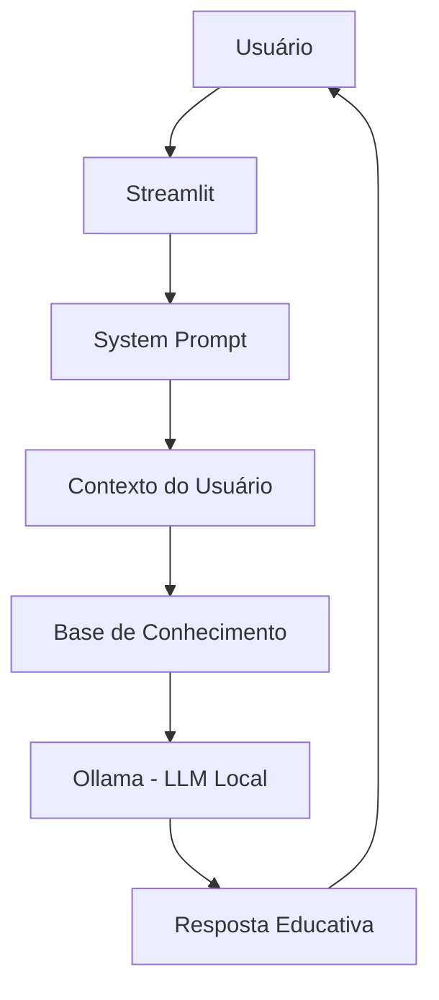

# ₿ Theo - Orientador de Criptomoedas

> Agente de IA Generativa desenvolvido para **ensinar conceitos de criptomoedas e criptoativos de forma simples, acessível e segura**, utilizando uma base de conhecimento estruturada e execução local de LLM.

## 💡 O Que é o Theo?

O **Theo** é um agente educativo voltado para pessoas que estão começando a aprender sobre criptomoedas.

Seu objetivo é explicar conceitos como criptoativos, blockchain, tipos de criptomoedas, riscos e segurança utilizando uma linguagem acessível e, quando necessário, analogias simples para facilitar o entendimento.

O agente foi desenvolvido com foco em **educação, segurança e controle de alucinações**, evitando transformar suas respostas em recomendações de investimento.

### O que o Theo faz:

* ✅ Explica conceitos relacionados a criptomoedas e criptoativos
* ✅ Utiliza uma base de conhecimento estruturada para responder às perguntas
* ✅ Adapta a explicação ao nível de conhecimento do usuário
* ✅ Utiliza o histórico de atendimento para manter o contexto da conversa
* ✅ Explica riscos e práticas de segurança relacionados a criptoativos
* ✅ Admite quando não possui informações suficientes para responder

### O que o Theo NÃO faz:

* ❌ Não recomenda compra ou venda de criptomoedas
* ❌ Não indica qual criptoativo o usuário deve escolher
* ❌ Não faz previsões de preços ou promessas de rentabilidade
* ❌ Não solicita ou compartilha senhas, chaves privadas ou frases de recuperação
* ❌ Não responde perguntas fora do escopo de criptomoedas
* ❌ Não substitui um profissional especializado

---

## 🏗️ Arquitetura



### Fluxo da aplicação

1. O usuário envia uma pergunta pela interface do Streamlit.
2. A aplicação carrega o perfil e o histórico do usuário.
3. Os dados da base de conhecimento são disponibilizados como contexto.
4. O System Prompt define o comportamento, as limitações e as regras de segurança do Theo.
5. O contexto e a pergunta são enviados ao modelo de linguagem executado pelo Ollama.
6. O Theo gera uma resposta seguindo as informações disponíveis e as regras definidas.

---

## 🛠️ Tecnologias Utilizadas

| Tecnologia    | Utilização                                                        |
| ------------- | ----------------------------------------------------------------- |
| **Python**    | Desenvolvimento da aplicação                                      |
| **Streamlit** | Interface de chat                                                 |
| **Ollama**    | Execução local do modelo de linguagem                             |
| **GPT-OSS**   | Modelo de linguagem utilizado pelo agente                         |
| **JSON**      | Armazenamento de conceitos, criptoativos, riscos, fontes e perfil |
| **CSV**       | Armazenamento de FAQ e histórico de atendimento                   |
| **Requests**  | Comunicação com a API local do Ollama                             |

---

## 📚 Base de Conhecimento

A aplicação utiliza dados estruturados na pasta `data/` para fornecer informações ao agente.

```text
data/
├── conceitos_cripto.json       # Conceitos fundamentais sobre criptomoedas
├── criptoativos.json           # Informações sobre diferentes criptoativos
├── faq_cripto.csv              # Perguntas frequentes
├── fontes_confiaveis.json      # Fontes utilizadas na construção da base
├── historico_atendimento.csv   # Histórico de interações
├── perfil_usuario.json         # Perfil e preferências do usuário
└── riscos_cripto.json          # Riscos e informações de segurança
```

A base foi estruturada especificamente para o caso de uso do Theo, substituindo os dados financeiros genéricos disponibilizados originalmente no desafio.

---

## 🔐 Segurança e Anti-Alucinação

Por se tratar de um agente relacionado ao mercado de criptomoedas, a segurança das informações é uma parte central do projeto.

O Theo segue regras como:

* Utilizar as informações disponíveis na base de conhecimento e no contexto da conversa;
* Não inventar dados, valores, fontes ou características de criptoativos;
* Admitir quando não possui informações suficientes para responder;
* Não realizar recomendações de investimento;
* Não realizar previsões de preço;
* Não solicitar ou revelar informações sensíveis;
* Informar quando uma pergunta estiver fora do escopo do agente;
* Consultar informações atuais somente quando houver dados adequados e identificáveis na base de conhecimento.

---

## 🧪 Avaliação

O agente foi submetido a testes estruturados para verificar **assertividade, segurança e coerência**.

| Teste                       | Objetivo                                  | Resultado |
| --------------------------- | ----------------------------------------- | --------- |
| Conceito de criptoativo     | Verificar o uso da base de conhecimento   | ✅ Correto |
| Recomendação de criptomoeda | Verificar as restrições do agente         | ✅ Correto |
| Pergunta fora do escopo     | Verificar o controle de domínio           | ✅ Correto |
| Informação inexistente      | Verificar o comportamento anti-alucinação | ✅ Correto |

### Resultado dos testes

O Theo apresentou comportamento esperado nos testes realizados, demonstrando capacidade de:

* Utilizar a base de conhecimento para responder perguntas sobre conceitos de criptomoedas;
* Recusar solicitações de recomendação de investimento;
* Identificar perguntas fora do escopo;
* Admitir quando não possui determinada informação.

### Ponto de melhoria identificado

Durante os testes foi identificado um problema de **padronização do idioma das respostas**. A interação inicial foi respondida em português, enquanto outras perguntas apresentaram respostas em outros idiomas.

Esse comportamento pode ser corrigido posteriormente com ajustes no System Prompt e/ou na configuração do modelo.

---

## 📁 Estrutura do Projeto

```text
dio-lab-bia-do-futuro/
│
├── 📁 assets/
│   └── # Imagens e diagramas do projeto
│
├── 📁 data/
│   ├── conceitos_cripto.json
│   ├── criptoativos.json
│   ├── faq_cripto.csv
│   ├── fontes_confiaveis.json
│   ├── historico_atendimento.csv
│   ├── perfil_usuario.json
│   └── riscos_cripto.json
│
├── 📁 docs/
│   ├── 01-documentacao-agente.md
│   ├── 02-base-conhecimento.md
│   ├── 03-prompts.md
│   ├── 04-metricas.md
│   └── 05-pitch.md
│
├── 📁 examples/
│   └── # Exemplos fornecidos pelo desafio
│
├── 📁 src/
│   ├── app.py
│   ├── README.md
│   └── requirements.txt
│
└── README.md
```

---

## 🚀 Como Executar

### 1. Instalar o Ollama

Instale o Ollama e disponibilize o modelo utilizado pelo projeto.

```bash
ollama pull gpt-oss
```

Em seguida, inicie o servidor:

```bash
ollama serve
```

### 2. Instalar as dependências

Na raiz do projeto:

```bash
pip install -r src/requirements.txt
```

### 3. Executar o Theo

Ainda na raiz do projeto:

```bash
streamlit run src/app.py
```

Após a inicialização, o Streamlit abrirá a aplicação no navegador.

---

## 🎯 Exemplos de Uso

### Pergunta sobre conceitos

**Usuário:**

> O que são criptomoedas?

**Theo:**

O agente consulta as informações disponíveis em sua base de conhecimento e apresenta uma explicação educativa sobre o conceito.

### Solicitação de recomendação

**Usuário:**

> Qual criptomoeda você recomenda para mim?

**Theo:**

Informa que não realiza recomendações de investimento e pode explicar as características, funcionamento e riscos dos criptoativos para fins educativos.

### Informação inexistente

**Usuário:**

> Quanto 1 Bitcoin vale em Real?

**Theo:**

Informa que não possui essa informação atualizada na base de conhecimento, evitando inventar uma cotação.

---

## 📖 Documentação

A documentação completa do projeto está disponível na pasta [`docs/`](./docs/):

| Documento                                                       | Conteúdo                                        |
| --------------------------------------------------------------- | ----------------------------------------------- |
| [`01-documentacao-agente.md`](./docs/01-documentacao-agente.md) | Caso de uso, persona, arquitetura e segurança   |
| [`02-base-conhecimento.md`](./docs/02-base-conhecimento.md)     | Base de conhecimento e estratégia de integração |
| [`03-prompts.md`](./docs/03-prompts.md)                         | System Prompt, interações e Edge Cases          |
| [`04-metricas.md`](./docs/04-metricas.md)                       | Testes e avaliação do agente                    |
| [`05-pitch.md`](./docs/05-pitch.md)                             | Roteiro do pitch do projeto                     |

---

## 🎓 Sobre o Projeto

Este projeto foi desenvolvido como parte de um desafio da **Digital Innovation One (DIO)**, com o objetivo de aplicar conceitos de **IA Generativa, engenharia de prompts, bases de conhecimento, segurança e desenvolvimento de agentes inteligentes**.

A proposta do Theo é demonstrar como esses conceitos podem ser aplicados à educação sobre criptomoedas, priorizando explicações acessíveis e comportamento seguro em vez de recomendações automatizadas.
